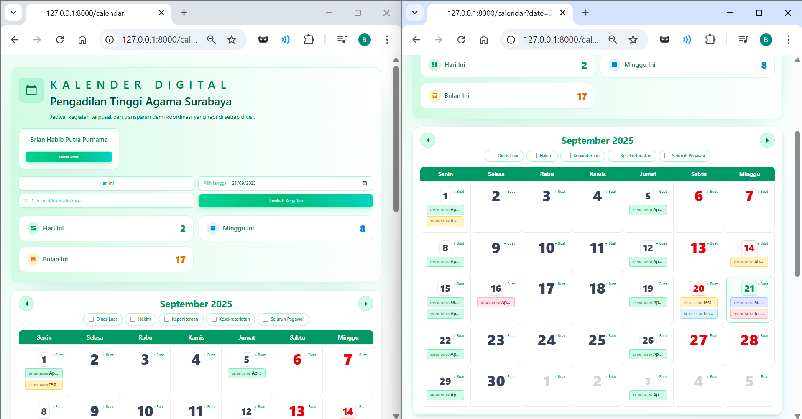
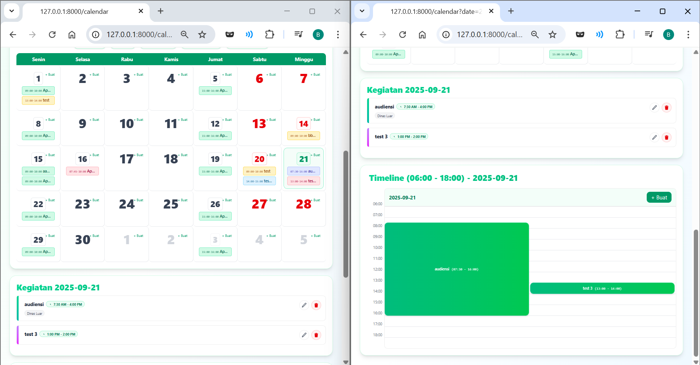
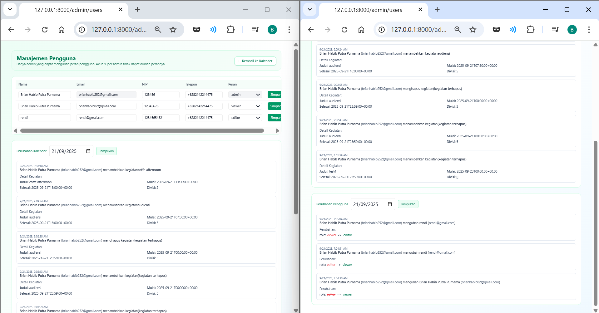

# Kalender Digital

A modern, role-based digital calendar for teams powered by Laravel 12, Inertia (Vue 3), and TailwindCSS. It includes authentication, division-based filtering, recurring events, and admin tools for managing users and auditing changes.

## Stack

- Backend: Laravel 12 (PHP 8.3+)
- SPA: Inertia.js + Vue 3 + Vite
- UI: Tailwind CSS
- Auth: Jetstream + Fortify + Sanctum; optional OAuth (GitHub/GitLab)
- Teams/Roles: Jetstream Teams; custom roles (admin, editor, viewer)
- Billing (optional): Stripe via Laravel Cashier
- API docs (optional): Scribe

## Requirements

- PHP 8.3+
- Composer
- Node 18+ (or Bun)
- MySQL 8+

## Quick Start (Local)

1) Clone and install

```bash
git clone https://github.com/Brianhabib252/Kalender-Digital.git
cd Kalender-Digital
composer install
npm install # or: bun install
```

2) Configure environment

Copy env file and set your database credentials:

```bash
cp .env.example .env
```

Edit `.env` (minimum):

```
APP_URL=http://127.0.0.1:8000
SANCTUM_STATEFUL_DOMAINS=127.0.0.1,localhost
SESSION_DOMAIN=localhost

DB_CONNECTION=mysql
DB_HOST=127.0.0.1
DB_PORT=3306
DB_DATABASE=kalender_digital
DB_USERNAME=your_user
DB_PASSWORD=your_pass
```

3) Generate key, migrate, and seed

```bash
php artisan key:generate
php artisan migrate --force
# Optional: seed default divisions and example events
php artisan db:seed --class=Database\Seeders\DivisionSeeder
php artisan db:seed --class=Database\Seeders\EventSeeder
```

4) Run the app (two terminals)

```bash
php artisan serve
npm run dev # or: bun run dev
```

Open the calendar at: `http://127.0.0.1:8000/calendar`

## Screenshots

These should reflect the current digital calendar UI. Add your captures to `public/images/` and adjust paths if needed.

- Calendar (Month): `public/images/calendar-month.png`
  - 
- Calendar (Day Timeline): `public/images/calendar-day.png`
  - 
- Admin – Perubahan Pengguna & Perubahan Kalender: `public/images/admin-users.png`
  - 

> Tip: You can add your own animated GIF demo by placing a file at `public/images/getting-started.gif` and linking it here.

## Features

- Calendar views
  - Month view with division chips and quick create
  - Day timeline (06:00–18:00) with overlap layout
  - Division filter and text search (title/location/description)
- Events
  - Create/Update/Delete with title, description, location
  - Divisions and participants (IDs; can be extended to autocomplete)
  - Recurrence: weekly (days + interval) and monthly (date + interval)
  - "Sepanjang hari" sets activity to 07:30–16:00 (workday hours)
- Roles
  - Viewer: read-only
  - Editor: can create and manage events they created
  - Admin: full access and can change roles for other users
- Admin tools
  - User management page (`/admin/users`): edit Name/Email/NIP/Phone/Role
  - Audit logs: date-filtered "Perubahan Pengguna" and "Perubahan Kalender"
  - Navigation button back to the calendar

## How To Use

- Login (Jetstream) and go to `/calendar`.
- Use "Pilih tanggal", navigation buttons, or chips to filter by division.
- Click "+ Buat" on a day or in the day timeline to add an activity.
- Admins can open profile pop-out → "Manajemen Pengguna", or go to `/admin/users` directly.
  - Change roles (viewer/editor/admin) and update user info, then "Simpan".
  - Use the date pickers at the top of each logs section to review changes for a specific day.

## API (Calendar)

- Auth: Sanctum cookie (front-end calls fetch `/sanctum/csrf-cookie` first)
- Endpoints (prefixed by `/api`):
  - `GET /api/events?start=ISO&end=ISO&q=string&division[]=ID`
  - `POST /api/events` (JSON body)
  - `PUT /api/events/{id}` (JSON body)
  - `DELETE /api/events/{id}`

Notes
- Filtering by `division[]` matches events linked to those divisions or with participants in those divisions.
- Recurring events are expanded for the requested date range (weekly/monthly, with interval and until).

## Testing

```bash
composer test
```

At the time of writing: 110 passed, 3 skipped (286 assertions).

## Production Notes

- Build assets: `npm run build` (or `bun run build`)
- Configure `APP_URL`, `SESSION_DOMAIN`, and cookies (Sanctum) correctly for your domain.
- Optional services: Stripe (Cashier), Sentry, Octane/Telescope

## Troubleshooting

- Division filter does not apply: ensure you are on the latest main; the calendar re-fetches when division chips change.
- "Sepanjang hari" spans full day: fixed to use 07:30–16:00; edit and re-save existing events if needed.
- Logs not recording: run migrations for `user_change_logs` and `event_change_logs`.

## License

MIT

